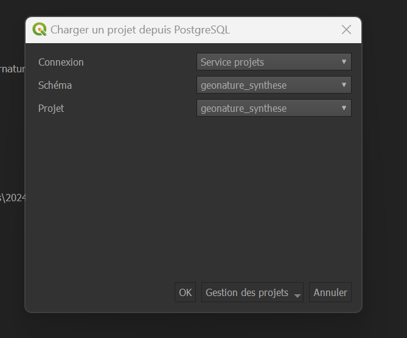

# Charger une couche depuis la base de données

## Explications
La base de données du parc contient des données organisées en tables auxquelles les agents du parc peuvent accéder par QGIS. 

## Vérifier que vous avez bien accès à la base de données par QGIS. 

Pour cela vous pouvez ouvrir QGIS et charger le projet depuis la base de données. 

- Cliquer sur l'onglet de la barre de menu "Projet"
- puis Ouvrir depuis >
- PostgreSQL

 

Si dans la connexion "Service projets" des schémas et projets s'affichent bien dans les menus déroulant, continuer, sinon passer à [ce tuto](./installer_certificats_base_de_donnees.md) et contacter le SI si besoin.
Sinon, continuer au paragraphe suivant.

### Charger une couche

- Ouvrir le gestionnaire de sources de données (ctrl + L ou en cliquant sur l'onglet "Couche" de la barre de menu puis gestionnaire de sources de données)
- Aller dans l'onglet "PostgreSQL"
- Dans le menu déroulant "Connexions" Sélectionner "Service projets"
- cliquer sur Connecter

S'affichent les différents [schémas](./glossaire#schema) (c'est-à-dire les dossiers) dans lesquels vous pouvez trouver les données. En les dépliants vous affichez les couches, qui ont des noms et des commentaires permettant d'identifier les données qu'elles contiennent. 

####  _Facultatif_ : Filtrer les données
Certaines tables (comme la table "detail" du schéma "geonature_synthese") sont _très_ lourdes. Afin d'éviter de saturer votre machine il est possible d'y appliquer un filtre en cliquant sur l'option "Filtrer". Ce filtre sera appliqué quand la table en question sera chargée en cliquant sur "Ajouter". 

Voire le [tutorial sur les filtres en cliquant ici](./filtres.md).

_NB: Tous les schémas ne sont pas accessibles à tous les agents, certains contenant des données sensibles. Si c'est votre cas, contacter le SI._

### Enregistrer une couche localement

Si vous souhaitez éditer une couche, il vous faudra copier les données de la base de données sur votre machine. 
Pour cela, faire clic droit sur la couche à sauvegarder puis 
> Exporter > Sauvegarder les entités sous
Puis en cliquant sur les "..." naviguer sur l'emplacement de votre machine ou vous souhaitez enregistrer la couche.

Une fois la nouvelle couche enregistrée, elle devrait apparaitre dans le projet. Vous pourrez vérifier qu'il s'agit bien d'une copie locale 
en vérifiant son emplacement dans ses propriétés (clic droit> Propriétés onglet Information).
Cette nouvelle couche est éditable, sans impact sur les données de la base de données. 
