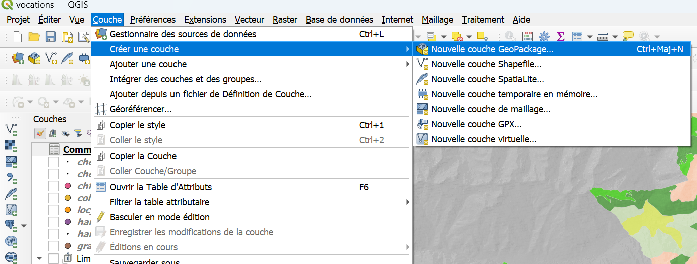

# Edition de polygones.

## Explications

Dans une couche au format [vecteur](./README.md#vecteur), il est possile de modifier ou d'ajouter des entités. 
Qgis permet de le faire en passant par le mode édition. 
Nous verrons ici comment créer une nouvelle couche vide, puis y créer des entités. Une fois les
entités créées, on peut facilement en modifier la géométrie ou les attributs. 

Il n'est possible de créer/modifier des entités que dans des couches dont vous êtes propriétaires. C'est-à-dire ou
bien des couches issues de fichiers enregistrés localement dans votre ordinateur, ou bien d'un serveur ou vous êtes identifié·e
et disposez des droits de création/modification. 

Attention, une fois une modification enregistrée, il n'est pas possible de revenir en arrière.

<!--Ce tutorial détaille les étapes permettant de configurer l'accès au catalogue de données WMS/WFS du Parc national du Mercantour.
Il exige d'avoir reçu au préalable un fichier zip du service informatique du Parc. --> 
Dans ce tuto, on crée une couche au format GeoPackage. Ce format ouvert et non-propriétaire présente l'avantage de ne contenir qu'un fichier (contrairement au shapefile) 
et s'ouvre facilement avec QGIS. 

 
 
## Pas à pas

### Créer une nouvelle couche. 
- Dans la barre des menus, Cliquer sur "Couche > Créer une couche > Nouvelle couche GeoPackage"

- Dans la fenêtre qui s'affiche, cliquer sur l'icône "..." pour renseigner l'emplacement où le fichier sera enregistré.
 

- Renseigner le type de géométrie selon le type d'usage voulu. Dans la plupart des cas: "Point", "Polyligne" ou "Polygone".
- Ne pas oublier d'indiquer la projection si elle est demandée: "EPSG:2154 - RGF v1 / Lambert-93"
- Si nécessaire, ajouter des champs. Il sera toujours possible d'en ajouter plus tard. 

### Activer le mode édition

- Activer le mode édition (2 façons possibles).

    Méthode 1 (_Recommandé_):  Sélectionner la couche à modifier, puis cliquer sur l'icône de crayon dans la barre d'outils en haut de l'écran  
 
	
    Méthode 2 :Cliquer droit sur la couche à modifier, puis en cliquant sur l'icône crayon "Basculer en mode édition"
 

- Une fois dans ce mode, un crayon apparait au-dessus du symbole de la couche..
 

- ..et des outils deviennent accessibles dans la barre d'outil. Ces outils sont regroupés dans les barres d'outils "Numérisation" et "Numérisation avancée".

- On peut afficher ces outils (s'ils n'apparaissent pas)  en faisant un clic droit sur une des barres d'outils en haut de l'écran, ou bien dans la barre de menu "Vue > Barres d'outils > ..."

 

_A partir de là, différentes opérations sont disponibles, nous ne décrirons que les plus simples._

### Créer une nouvelle entité

- Proche de l'icone de crayon, dans la barre d'outils, se trouve l'icône "Ajouter une entité"

 

- Après avoir cliqué dessus, votre curseur change. Vous pouvez directement ajouter des points qui formeront, suivant le type de géométrie que votre couche contient
	- une entité par point
	- une partie de ligne ou de polygone
- Un clic gauche vous permet d'ajouter un point, un clic droit termine la saisie d'une entité sans en rajouter de nouveau, _donc pour faire un rectangle, il faut 4 clics gauches + 1 clic droit_.
- A chaque fin de saisie, une boite de dialogue s'ouvre, permettant d'entrer manuellement les attributs de l'entité. Dans la plupart des cas, vous n'êtes pas obligé d'entrer
quoi que ce soit, et pouvez simplement cliquer sur OK pour continuer la saisie. 

 

### Modifier la géométrie d'une entité existante

- L'outil sommet, disponible dans la barre d'outil numérisation à droite de l'outil d'ajout d'entité permet d'ajouter, supprimer, ou créer de nouveaux sommets.
 
- Une fois l'outil sommet sélectionné, on peut sélectionner n'importe quel sommet en cliquant dessus. Les sommets de chaque polygone sont visibles sous la forme de petits cercles rouges

 

- Après avoir sélectionné un sommet avec l'outil sommet, il est possible de le supprimer en appuyant sur la touche "Suppr" du clavier. 
- On peut aussi le déplacer, en cliquant à nouveau avec le clic gauche à un autre endroit après avoir sélectionné un sommet. 

- Enfin, il est possible de créer de nouveaux sommets dans un polygone en cliquant très précisément sur la croix qui apparait en faisant passer le curseur entre deux sommets. 
 

En combinant le déplacement, la modification, et la création de sommets, il est possible de changer complètement la forme d'un polygone.

_Tant que les modifications n'ont pas été enregistrées, elles ne sont pas définitives_

### Supprimer une entité

- Une fois dans le mode édition, il est aussi possible de supprimer complètement une entité en la sélectionnant avec l'outil de sélection, puis en appuyant sur la touche suppr.
 

### Modifier les attributs d'une entité

- Une fois activé l'outil édition, il est possible d'éditer à la main les cases de la table attributaire. 
_On peut aussi activer le mode édition depuis la barre d'outils de la table attributaire._
 

