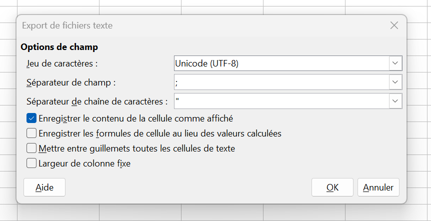

# Taxrefmatch et cd_nom

## Explication
Afin que les données naturalistes puissent être partagées et échangées, chaque taxon est associé à un identifiant numérique unique qui s'appelle le cd_nom.
Ce numéro est extrêmement important puisqu'il permet de suivre les observations indépendemment des changements de noms, d'orthographe, de taxonomie.

Or, de façon générale, les relevés naturalistes sont faits en utilisant un nom. Il faut donc leur associer un cd_nom. 

Taxrefmatch est un outil qui permet à partir d'un nom scientifique de taxon de retrouver le cd_nom associé, et donc l'ensemble de ses propriétés (nom scientifique valide, niveau taxonomique etc...).

En combinant taxrefmatch et les formules disponibles sur LibreOffice il est possible d'automatiser et de simplifier le processus associant à chaque nom de taxon saisi un cd_nom correct et unique. 

Ce processus peut être fait en trois étapes: 

- récupérer la liste des noms de taxons observés sans doublons
- l'utiliser pour obtenir la correspondance entre noms de taxons et cd_nom par taxrefmatch
- utiliser les outils de libreoffice pour automatiser la mise en relation et obtenir un cd_nom pour chaque observation

## Pas à pas

### Situation de départ

Soit un tableau d'observations sur un format similaire à ce qui suit nommé "observations.csv"

|Date|Observateur|Taxon|x|y|
|:--:|:--:|:--:|:--:|:--:|
|12/10/2016|Paul Bismut|Nicrophorus vespilloides|7.070697|44.204141|
|10/12/2016|Serge Plouf|Cossus cossus|7.020686|44.188697|
|16/10/2012|Jean-Paul Pierre|Glomeris klugii|7.10808|44.207472|
|...|...|...|...|....|

à ce tableau il manque le cd_nom pour pouvoir être enregistré dans une base de données. ( Un grand nombre d'informations supplémentaires peuvent être ajoutées : le déterminateur, les effectifs observés, la méthode d'observation...) 

Afin de l'obtenir on va utiliser taxref-match: 
[https://taxref.mnhn.fr/taxref-match/taxrefmatch/import](https://taxref.mnhn.fr/taxref-match/taxrefmatch/import)

#### Liste des taxons sans doublons au format taxref-match
On peut procéder de la façon suivante pour obtenir une liste des taxons saisis sans doublon:

- créer un nouveau fichier "input-taxrefmatch.csv".
- copier la colonne contenant les noms de taxon de "observations.csv" en première colonne du nouveau fichier
- cliquer sur "Données->plus de filtres->filtre standard"

 

- dans la boite de dialogue qui s'ouvre, 
	- changer premier nom de champ  vers "aucun" 
	- cocher la case "sans doublon"
	- cocher "copier le résultat vers" et choisir une case vide
- On obtient ainsi la liste des taxons

- Ajouter les colonnes "classification" où ajouter les informations des taxons supérieurs séparés par des virgules comme indiqué [ici](https://taxref.mnhn.fr/taxref-match/taxrefmatch/taxrefMatchDoc) et une colonne fk que l'on peut laisser vide.

_On peut faire un premier essai en laissant vide la deuxième colonne, mais il est possible que certaines correspondances ne se fassent pas, ou mal ci dessous un exemple de tableau_

|nom_complet|classification|fk|
|:--:|:--:|:--:|
|helix lapicidus linné 1758)|mollusca,gastropoda,helicidae||
|Cyclops minutus O.F. Müller, 1776|||

 
- On peut ensuite enregistrer en faisant attention à bien spécifier d'utiliser des points-virgule comme séparateur.

- et enfin soumettre le fichier à taxref match : [https://taxref.mnhn.fr/taxref-match/taxrefmatch/import](https://taxref.mnhn.fr/taxref-match/taxrefmatch/import)

### Utiliser le résultat de taxref pour obtenir les cd_nom

- On récupère un fichier nommé "résultats.csv", le renommer en "taxrefmatch.csv" et renommer la première page en "taxrefmatch"

- Dans le fichier "observation.csv" créer une nouvelle colonne "cd_nom".

On va maintenant y inscrire une formule pour obtenir automatiquement les cd_nom de "taxrefmatch.csv".

Dans LibreOffice la formule "=RECHERCHEV" permet de réaliser cette opération. 

Cette formule prend la valeur d'une cellule, puis va la chercher dans une plage de cellules données, et renvoie la valeur d'une colonne à la même ligne.
Elle permet donc de récupérer les cd_nom des espèces dont le nom est présent dans "observations.csv" et "taxrefmatch.csv"

il faudra donc utiliser la formule :
=RECHERCHEV(A;B;C;D)

en remplacant:

A : numéro de la cellule contenant le nom de taxon saisi

B : le chemin vers le fichier taxrefmatch, et la plage de cellules contenant les données. il s'écrit de la façon suivante: 

> 'file///c/:utilisateurs/nomutilisateur/documents/taxrefmatch.csv'#taxrefmatch.A1:D99

que l'on décompose en plusieurs parties: 

- où la partie entre guillements décrit le chemin vers le fichier, sans majuscule

- le nom de la page précédé d'un # (ici #taxrefmatch)

- la fin de la formule (A1:D99) définit la plage de donnée dans laquelle libreoffice va chercher le nom du taxon. 

C: numéro de la colonne dans la plage de cellule définie en B

D: indique l'ordre de tri, laisser à 0

- On peut ensuite copier/coller la formule sur toute la colonne

Enfin, pour transformer la formule en valeur il suffit de sélectionner la nouvelle colonne de cd_noms, puis de cliquer sur "Données>calculer>formules en valeur".

Attention! Il faudra alors vérifier puisque certaines correspondances peuvent avoir échouer. Dans ce cas, réessayer en complétant la colonne "classification" différemment avant de soumettre à taxref-match, ou bien les compléter à la main à partir du [site de l'inpn](https://inpn.mnhn.fr/) 
